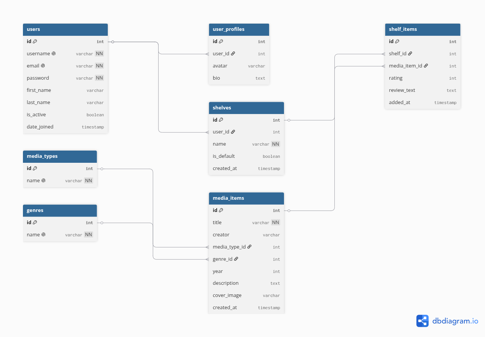

# ShelfSpace

A personal media collection and discovery platform. Track, rate, and organize your media across books, movies, games, and music.

## Features

- **User Authentication** — Register, login, and manage your profile with JWT-based security
- **Media Catalog** — Browse a curated collection of books, movies, games, and music
- **Search & Filter** — Find media by title, creator, type, or genre
- **Personal Shelves** — Organize items into "Want to Try," "In Progress," and "Finished" collections
- **Ratings & Reviews** — Rate items 1-5 stars and write personal reviews
- **Dashboard** — View statistics about your media consumption habits
- **API Documentation** — Fully documented REST API with Swagger UI


## Project Structure
ShelfSpace/
├── backend/
│   ├── api/                  
│   ├── shelfspace/       
│   ├── manage.py
│   ├── requirements.txt
│   ├── Dockerfile
│   └── db_diagram.png
├── frontend/
│   ├── src/
│   │   ├── components/       
│   │   ├── services/        
│   │   └── App.js
│   ├── public/
│   ├── package.json
│   └── Dockerfile
├── docker-compose.yml
├── .github/
│   └── workflows/
│       └── deploy.yml        
└── README.md

## Tech Stack

| Layer | Technology |

| Backend | Django 4.2 + Django REST Framework |
| Authentication | JWT (djangorestframework-simplejwt) |
| API Docs | drf-spectacular (OpenAPI/Swagger) |
| Database | PostgreSQL (production) / SQLite (development) |
| Frontend | React 18 + React Router |
| Styling | Inline CSS (customizable) |
| Containerization | Docker + Docker Compose |
| CI/CD | GitHub Actions |

## Database Schema



## API Endpoints

| Endpoint | Method | Description |

| `/api/register/` | POST | Create new user account |
| `/api/token/` | POST | Obtain JWT access token |
| `/api/token/refresh/` | POST | Refresh JWT token |
| `/api/media-items/` | GET | List all media items |
| `/api/media-items/` | POST | Create new media item |
| `/api/shelves/` | GET | List user's shelves |
| `/api/shelves/<id>/add_item/` | POST | Add item to shelf |
| `/api/shelf-items/` | GET, PUT, PATCH, DELETE | Manage shelf items |
| `/api/docs/` | GET | Swagger UI documentation |


### Prerequisites

- Docker & Docker Compose
- Node.js 20+
- Python 3.11+

### Author
- Created by Keshawn Kingori

## Local Development (Without Docker)

### Backend
- cd backend
- python -m venv venv
- source venv/bin/activate
- pip install -r requirements.txt
- python manage.py migrate
- python manage.py seed_data
- python manage.py runserver

### Frontend (new terminal)
- cd frontend
- npm install
- npm start

### Local Development (Docker)

```bash
# Clone repository
git clone https://github.com/YOUR_USERNAMEKeshawn-K/ShelfSpace.git
cd ShelfSpace

